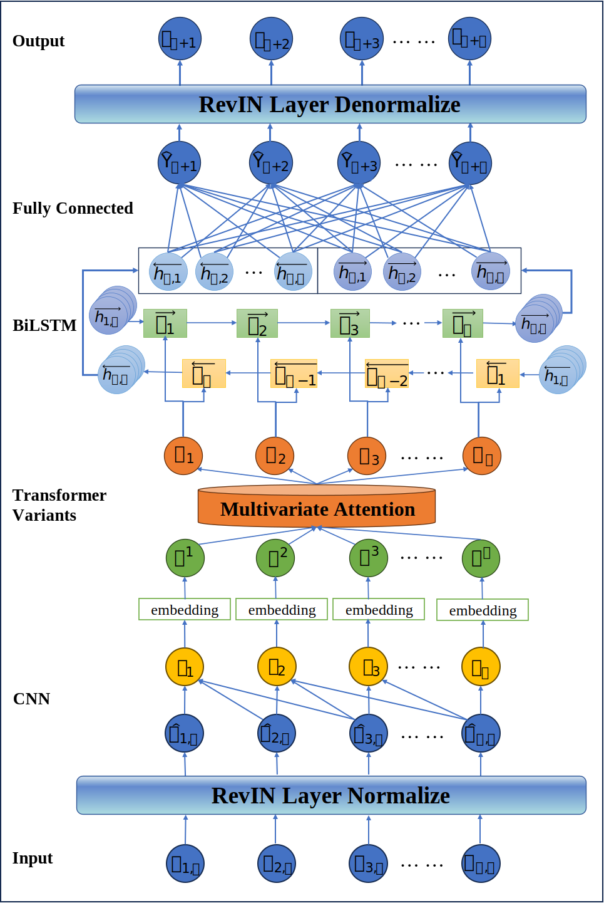

# Knowledge-Driven Modular Deep Learning Framework for Financial Time-Series Forecasting

This repository contains the official source code and data for the research paper: **"Knowledge-Driven Modular Deep Learning Framework Integrating CNN, Transformer Variants and BiLSTM for Robust Financial Time-Series Forecasting"**.

Our proposed framework, **RevIN-CNN-(Transformer Variants)-BiLSTM**, is a modular and robust deep learning architecture designed to tackle the inherent challenges of financial time series forecasting, such as high noise, non-stationarity, and complex dependencies.

---

## 🏛️ Framework Architecture

The core of our work is a synergistic, modular framework where each component targets a specific challenge in financial forecasting:

<p align="center">
  
</p>

-   **RevIN (Reversible Instance Normalization):** Mitigates distribution shifts common in non-stationary time series.
-   **CNN (Convolutional Neural Network):** Extracts local, short-term patterns and features.
-   **Transformer Variants:** A pluggable core (e.g., vanilla Transformer, iTransformer) to capture long-range dependencies.
-   **BiLSTM (Bidirectional LSTM):** Models bidirectional sequential dynamics, capturing information from both past and future contexts.

---

## ✨ Key Features

-   **High Versatility:** The modular design allows for easy substitution of the Transformer core, making the framework adaptable to future advancements in Transformer architectures.
-   **Statistical Robustness:** Effectively handles non-stationary data with extreme values, validated by strong cross-market generalization performance.
-   **Proven Superiority:** Outperforms various baseline models significantly, with performance gains validated by rigorous Diebold-Mariano statistical tests.
-   **Full Reproducibility:** All code, sample data, and experimental configurations are provided to ensure the full reproducibility of our findings.

---

## 🚀 Getting Started

Follow these instructions to set up the project environment and reproduce our results.

### Prerequisites

-   Python 3.12
-   Conda or venv for environment management
-   An NVIDIA GPU with CUDA support is recommended for training.

### Installation

Due to the project's reliance on specific GPU hardware acceleration (CUDA), the installation process requires `conda` to properly manage the environment. Please follow these steps carefully.

1.  **Clone the repository:**
    ```bash
    git clone [https://github.com/DyeDye-diyung/Framework_for_Financial_Time-Series_Forecasting.git](https://github.com/DyeDye-diyung/Framework_for_Financial_Time-Series_Forecasting.git)
    cd Framework_for_Financial_Time-Series_Forecasting
    ```

2.  **Create and activate a Conda environment:**
    
    It is highly recommended to create a new Conda environment to avoid conflicts with existing packages.

    ```bash
    conda create -n stock_forecast python=3.12
    conda activate stock_forecast
    ```
    
3.  **Install Core GPU and PyTorch Dependencies:**

    This is the most critical step for ensuring hardware acceleration works correctly. This project requires a specific build of PyTorch (v2.3.1) that is compatible with CUDA 11.8 and Python 3.12.

    *Note: This specific version may only be available through particular Conda channels (in this case, the Tsinghua University mirror for PyTorch). Official channels may not host this exact build. Therefore, it is **essential** to use the following command which explicitly points to the correct channels to install PyTorch, the CUDA Toolkit, and cuDNN together. This ensures perfect compatibility between all core libraries.*

    ```bash
    conda install cudatoolkit=11.8.0 cudnn=8.8.0 pytorch=2.3.1=py3.12_cuda11.8_cudnn8_0 torchvision=0.18.1=py312_cu118 torchaudio=2.3.1=py312_cu118 pytorch-cuda=11.8 -c https://mirrors.tuna.tsinghua.edu.cn/anaconda/cloud/pytorch/win-64 -c nvidia
    ```

4. **Install Remaining Dependencies:**

    Once the core libraries are installed, you can install the remaining Python packages using `pip` and the `requirements.txt` file.

    ```bash
    python -m pip install -r requirements.txt
    ```
   
    Or,  you can install the remaining Python packages using `conda`.

    ```bash
    conda install --yes --file requirements.txt
    ```

5.  **(Fallback Option) Alternate Installation Methods:**

    If you encounter persistent dependency conflicts with the standard installation, you can use one of the following fallback methods to replicate the exact project environment.

    **Method A: Create from Environment File (Recommended)**

    This method uses the `environment.yml` file included in the repository to automatically create a new Conda environment with all specified packages and versions.

    ```bash
    # This command creates an environment named 'transformer_stock_prediction' as specified in the file
    conda env create -f environment.yml
    conda activate transformer_stock_prediction
    ```

    **Method B: Direct Environment Cloning**

    This method involves downloading a complete, pre-built environment folder. It is faster but may be less portable across different operating systems.

    1.  Download the compressed environment folder from: **[Google Drive Link](https://drive.google.com/drive/folders/1KNErZCA-WFEPURbE0Mudm3GM_Glctggv?usp=drive_link)**. *(If the link is inaccessible and you require this file, please contact the corresponding author of our paper via email.)*
    2.  Extract the `.zip` file and copy the resulting folder (e.g., `transformer_stock_prediction`) into your main Conda environments directory (e.g., `C:\Users\Admin\anaconda3\envs`, you can find the path by running `conda info --envs`). Example path after copying: `C:\Users\Admin\anaconda3\envs\transformer_stock_prediction`.
    3.  Run the following commands to register and activate the environment:

    ```bash
    # Add your envs directory to conda's configuration to ensure it's recognized
    # Replace the path below with your actual envs path
    conda config --append envs_dirs C:\Users\Admin\anaconda3\envs

    # Verify that conda now sees the environment
    conda env list

    # Activate the environment (the folder name is the environment name)
    conda activate transformer_stock_prediction
    ```

---

## 📈 Usage & Reproducing Results

The workflow is divided into four main steps: data preparation, model training, evaluation, and statistical testing.

### Step 1: Data Preparation

First, you need to download the raw stock data and then preprocess it to generate features.

1.  **Download Raw Data:**
    The `get_data.py` script uses the `akshare` library to download historical data for the four stocks used in the paper. The data will be saved in the `/data` directory.
    ```bash
    python -m utils.get_data
    ```

2.  **Preprocess Data:**
    The `preprocess.py` script takes the raw data, computes all technical and time-series features, and saves a unified `processed_dataset.csv` file in the `/data` directory. This file will be used for training and testing.
    ```bash
    python -m utils.preprocess --targets Apple --processors technical_indicators fourier_components
    ```

### Step 2: Model Training

The `train.py` script is used to train all models. You can specify the model architecture and target dataset via command-line arguments. To reproduce our paper's results, all 13 models must be trained.

**Example: Training our best model (`RevIN-CNN-iTransformer-BiLSTM`) on the Apple dataset:**
```bash
python -m utils.train new Apple --num-days-for-predict 96 --batch-size 32 --learning-rate 0.0001 --model_use RevIN_CNN_iTransformer_BiLSTM
```

Training logs and model checkpoints will be saved to the `lightning_logs/` directory, organized by version number (e.g., `version_0`, `version_1`, etc.).

**To train all models used in the paper, you can run the commands sequentially:**

```bash
python -m utils.train new Apple --num-days-for-predict 96 --batch-size 32 --learning-rate 0.0001 --model_use RevIN_CNN_iTransformer_BiLSTM
python -m utils.train new Apple --num-days-for-predict 96 --batch-size 32 --learning-rate 0.0001 --model_use RevIN_CNN_Transformer_BiLSTM
python -m utils.train new Apple --num-days-for-predict 96 --batch-size 32 --learning-rate 0.0001 --model_use CNN_BiLSTM_Attention
python -m utils.train new Apple --num-days-for-predict 96 --batch-size 32 --learning-rate 0.0001 --model_use SCINet
python -m utils.train new Apple --num-days-for-predict 96 --batch-size 32 --learning-rate 0.0001 --model_use GAN
python -m utils.train new Apple --num-days-for-predict 96 --batch-size 32 --learning-rate 0.0001 --model_use Transformer
python -m utils.train new Apple --num-days-for-predict 96 --batch-size 32 --learning-rate 0.0001 --model_use iTransformer
python -m utils.train new Apple --num-days-for-predict 96 --batch-size 32 --learning-rate 0.0001 --model_use CNN_iTransformer_BiLSTM
python -m utils.train new Apple --num-days-for-predict 96 --batch-size 32 --learning-rate 0.0001 --model_use RevIN_iTransformer_BiLSTM
python -m utils.train new Apple --num-days-for-predict 96 --batch-size 32 --learning-rate 0.0001 --model_use RevIN_CNN_iTransformer
python -m utils.train new Apple --num-days-for-predict 96 --batch-size 32 --learning-rate 0.0001 --model_use CNN_Transformer_BiLSTM
python -m utils.train new Apple --num-days-for-predict 96 --batch-size 32 --learning-rate 0.0001 --model_use RevIN_Transformer_BiLSTM
python -m utils.train new Apple --num-days-for-predict 96 --batch-size 32 --learning-rate 0.0001 --model_use RevIN_CNN_Transformer
```

### Step 3: Predict and Test

After training, use the `test.py` script to load a checkpoint and generate predictions, evaluation metrics, and result plots.

**Example: Evaluating the trained model on the Apple dataset:**

```bash
# Replace 'path/to/your/checkpoint.ckpt' with the actual path from lightning_logs
python -m utils.test lightning_logs/version_0/checkpoints/last.ckpt  --model_use RevIN_CNN_iTransformer_BiLSTM --test_target Apple
```

This will generate prediction CSVs and images in the corresponding `lightning_logs/version_0/` subdirectories. Repeat this for all models and datasets to generate all necessary evaluation files.

**To reproduce all evaluation results from the paper, you must run the tests for all models across all four datasets. Preprocessing should be done before a new dataset is tested. For your convenience, we have listed all these commands here:**

```bash
python -m utils.preprocess --targets Apple --processors technical_indicators fourier_components
python -m utils.test lightning_logs/version_0/checkpoints/last.ckpt  --model_use RevIN_CNN_iTransformer_BiLSTM --test_target Apple
python -m utils.test lightning_logs/version_1/checkpoints/last.ckpt  --model_use RevIN_CNN_Transformer_BiLSTM --test_target Apple
python -m utils.test lightning_logs/version_2/checkpoints/last.ckpt  --model_use CNN_BiLSTM_Attention --test_target Apple
python -m utils.test lightning_logs/version_3/checkpoints/last.ckpt  --model_use SCINet --test_target Apple
python -m utils.test lightning_logs/version_4/checkpoints/last.ckpt  --model_use GAN --test_target Apple
python -m utils.test lightning_logs/version_5/checkpoints/last.ckpt  --model_use Transformer --test_target Apple
python -m utils.test lightning_logs/version_6/checkpoints/last.ckpt  --model_use iTransformer --test_target Apple
python -m utils.test lightning_logs/version_7/checkpoints/last.ckpt  --model_use CNN_iTransformer_BiLSTM --test_target Apple
python -m utils.test lightning_logs/version_8/checkpoints/last.ckpt  --model_use RevIN_iTransformer_BiLSTM --test_target Apple
python -m utils.test lightning_logs/version_9/checkpoints/last.ckpt  --model_use RevIN_CNN_iTransformer --test_target Apple
python -m utils.test lightning_logs/version_10/checkpoints/last.ckpt  --model_use CNN_Transformer_BiLSTM --test_target Apple
python -m utils.test lightning_logs/version_11/checkpoints/last.ckpt  --model_use RevIN_Transformer_BiLSTM --test_target Apple
python -m utils.test lightning_logs/version_12/checkpoints/last.ckpt  --model_use RevIN_CNN_Transformer --test_target Apple
python -m utils.preprocess --targets Microsoft --processors technical_indicators fourier_components
python -m utils.test lightning_logs/version_0/checkpoints/last.ckpt  --model_use RevIN_CNN_iTransformer_BiLSTM --test_target Microsoft
python -m utils.test lightning_logs/version_1/checkpoints/last.ckpt  --model_use RevIN_CNN_Transformer_BiLSTM --test_target Microsoft
python -m utils.test lightning_logs/version_2/checkpoints/last.ckpt  --model_use CNN_BiLSTM_Attention --test_target Microsoft
python -m utils.test lightning_logs/version_3/checkpoints/last.ckpt  --model_use SCINet --test_target Microsoft
python -m utils.test lightning_logs/version_4/checkpoints/last.ckpt  --model_use GAN --test_target Microsoft
python -m utils.test lightning_logs/version_5/checkpoints/last.ckpt  --model_use Transformer --test_target Microsoft
python -m utils.test lightning_logs/version_6/checkpoints/last.ckpt  --model_use iTransformer --test_target Microsoft
python -m utils.test lightning_logs/version_7/checkpoints/last.ckpt  --model_use CNN_iTransformer_BiLSTM --test_target Microsoft
python -m utils.test lightning_logs/version_8/checkpoints/last.ckpt  --model_use RevIN_iTransformer_BiLSTM --test_target Microsoft
python -m utils.test lightning_logs/version_9/checkpoints/last.ckpt  --model_use RevIN_CNN_iTransformer --test_target Microsoft
python -m utils.test lightning_logs/version_10/checkpoints/last.ckpt  --model_use CNN_Transformer_BiLSTM --test_target Microsoft
python -m utils.test lightning_logs/version_11/checkpoints/last.ckpt  --model_use RevIN_Transformer_BiLSTM --test_target Microsoft
python -m utils.test lightning_logs/version_12/checkpoints/last.ckpt  --model_use RevIN_CNN_Transformer --test_target Microsoft
python -m utils.preprocess --targets MaoTai --processors technical_indicators fourier_components
python -m utils.test lightning_logs/version_0/checkpoints/last.ckpt  --model_use RevIN_CNN_iTransformer_BiLSTM --test_target MaoTai
python -m utils.test lightning_logs/version_1/checkpoints/last.ckpt  --model_use RevIN_CNN_Transformer_BiLSTM --test_target MaoTai
python -m utils.test lightning_logs/version_2/checkpoints/last.ckpt  --model_use CNN_BiLSTM_Attention --test_target MaoTai
python -m utils.test lightning_logs/version_3/checkpoints/last.ckpt  --model_use SCINet --test_target MaoTai
python -m utils.test lightning_logs/version_4/checkpoints/last.ckpt  --model_use GAN --test_target MaoTai
python -m utils.test lightning_logs/version_5/checkpoints/last.ckpt  --model_use Transformer --test_target MaoTai
python -m utils.test lightning_logs/version_6/checkpoints/last.ckpt  --model_use iTransformer --test_target MaoTai
python -m utils.test lightning_logs/version_7/checkpoints/last.ckpt  --model_use CNN_iTransformer_BiLSTM --test_target MaoTai
python -m utils.test lightning_logs/version_8/checkpoints/last.ckpt  --model_use RevIN_iTransformer_BiLSTM --test_target MaoTai
python -m utils.test lightning_logs/version_9/checkpoints/last.ckpt  --model_use RevIN_CNN_iTransformer --test_target MaoTai
python -m utils.test lightning_logs/version_10/checkpoints/last.ckpt  --model_use CNN_Transformer_BiLSTM --test_target MaoTai
python -m utils.test lightning_logs/version_11/checkpoints/last.ckpt  --model_use RevIN_Transformer_BiLSTM --test_target MaoTai
python -m utils.test lightning_logs/version_12/checkpoints/last.ckpt  --model_use RevIN_CNN_Transformer --test_target MaoTai
python -m utils.preprocess --targets HSBC --processors technical_indicators fourier_components
python -m utils.test lightning_logs/version_0/checkpoints/last.ckpt  --model_use RevIN_CNN_iTransformer_BiLSTM --test_target HSBC
python -m utils.test lightning_logs/version_1/checkpoints/last.ckpt  --model_use RevIN_CNN_Transformer_BiLSTM --test_target HSBC
python -m utils.test lightning_logs/version_2/checkpoints/last.ckpt  --model_use CNN_BiLSTM_Attention --test_target HSBC
python -m utils.test lightning_logs/version_3/checkpoints/last.ckpt  --model_use SCINet --test_target HSBC
python -m utils.test lightning_logs/version_4/checkpoints/last.ckpt  --model_use GAN --test_target HSBC
python -m utils.test lightning_logs/version_5/checkpoints/last.ckpt  --model_use Transformer --test_target HSBC
python -m utils.test lightning_logs/version_6/checkpoints/last.ckpt  --model_use iTransformer --test_target HSBC
python -m utils.test lightning_logs/version_7/checkpoints/last.ckpt  --model_use CNN_iTransformer_BiLSTM --test_target HSBC
python -m utils.test lightning_logs/version_8/checkpoints/last.ckpt  --model_use RevIN_iTransformer_BiLSTM --test_target HSBC
python -m utils.test lightning_logs/version_9/checkpoints/last.ckpt  --model_use RevIN_CNN_iTransformer --test_target HSBC
python -m utils.test lightning_logs/version_10/checkpoints/last.ckpt  --model_use CNN_Transformer_BiLSTM --test_target HSBC
python -m utils.test lightning_logs/version_11/checkpoints/last.ckpt  --model_use RevIN_Transformer_BiLSTM --test_target HSBC
python -m utils.test lightning_logs/version_12/checkpoints/last.ckpt  --model_use RevIN_CNN_Transformer --test_target HSBC

```

### Step 4: Aggregate Results and Statistical Tests

Once all models have been evaluated, you can aggregate the results and perform statistical tests.

1.  **Aggregate Evaluation Metrics:**
    The `evaluate.py` script collects all individual `_Evaluation.csv` files and creates summary tables.

    ```bash
    python -m utils.evaluate
    ```

    This will generate summary files like `Apple_Summary.csv` in the `/evaluate_results` folder.

2.  **Perform Diebold-Mariano Test:**
    The `dm_test.py` script performs statistical tests to verify if the performance improvement of our model is significant.

    **Example: Comparing our best model against baselines on the Apple test set:**

    ```bash
    python -m utils.dm_test --test_set Apple --reference_model "RevIN-CNN-iTransformer-BiLSTM" --comparison_models "RevIN-CNN-Transformer-BiLSTM" "CNN-BiLSTM-Attention" "SCINet" "GAN" "Transformer" "iTransformer"  --crit MSE --subset Test
    ```

    The results will be printed to the console and saved to the `/DM_Test_results` folder.

    **To perform all Diebold-Mariano Tests used in the paper, these commands are necessary:**

    ```bash
    python -m utils.dm_test --test_set Apple --reference_model "RevIN-CNN-iTransformer-BiLSTM" --comparison_models "RevIN-CNN-Transformer-BiLSTM" "CNN-BiLSTM-Attention" "SCINet" "GAN" "Transformer" "iTransformer"  --crit MSE --subset Test
    python -m utils.dm_test --test_set Microsoft --reference_model "RevIN-CNN-iTransformer-BiLSTM" --comparison_models "RevIN-CNN-Transformer-BiLSTM" "CNN-BiLSTM-Attention" "SCINet" "GAN" "Transformer" "iTransformer"  --crit MSE --subset All
    python -m utils.dm_test --test_set MaoTai --reference_model "RevIN-CNN-iTransformer-BiLSTM" --comparison_models "RevIN-CNN-Transformer-BiLSTM" "CNN-BiLSTM-Attention" "SCINet" "GAN" "Transformer" "iTransformer"  --crit MSE --subset All
    python -m utils.dm_test --test_set HSBC --reference_model "RevIN-CNN-iTransformer-BiLSTM" --comparison_models "RevIN-CNN-Transformer-BiLSTM" "CNN-BiLSTM-Attention" "SCINet" "GAN" "Transformer" "iTransformer"  --crit MSE --subset All
    ```
    
3.  **(Optional) Generate Comparison Plots 🎨:**
    The `draw_figure.py` script is provided to visualize and compare the predictions of multiple models against the true values on a single plot. This is useful for creating the final figures for the paper.

    **Example: Generating the comparison plot for the Apple test set within a specific date range:**
    ```bash
    python -m utils.draw_figure --test_target Apple --true_csv_path data/Apple.csv \
      --pred_csv_paths lightning_logs/version_0/test_prediction/Apple_test_pred.csv lightning_logs/version_1/test_prediction/Apple_test_pred.csv lightning_logs/version_2/test_prediction/Apple_test_pred.csv lightning_logs/version_3/test_prediction/Apple_test_pred.csv lightning_logs/version_4/test_prediction/Apple_test_pred.csv lightning_logs/version_5/test_prediction/Apple_test_pred.csv lightning_logs/version_6/test_prediction/Apple_test_pred.csv \
      --model_names RevIN_CNN_iTransformer_BiLSTM RevIN_CNN_Transformer_BiLSTM CNN_BiLSTM_Attention SCINet GRU_GAN Transformer iTransformer \
      --date_range 2024-01-17 2025-01-01
    ```

    **To generate all four comparison plots used in the paper, you can use the provided commands:**
    ```bash
    python -m utils.draw_figure --test_target Apple --true_csv_path data/Apple.csv --pred_csv_paths lightning_logs/version_0/test_prediction/Apple_test_pred.csv lightning_logs/version_1/test_prediction/Apple_test_pred.csv lightning_logs/version_2/test_prediction/Apple_test_pred.csv lightning_logs/version_3/test_prediction/Apple_test_pred.csv lightning_logs/version_4/test_prediction/Apple_test_pred.csv lightning_logs/version_5/test_prediction/Apple_test_pred.csv lightning_logs/version_6/test_prediction/Apple_test_pred.csv --model_names RevIN_CNN_iTransformer_BiLSTM RevIN_CNN_Transformer_BiLSTM CNN_BiLSTM_Attention SCINet GRU_GAN Transformer iTransformer --date_range 2024-01-17 2025-01-01
    python -m utils.draw_figure --test_target Microsoft --true_csv_path data/Microsoft.csv --pred_csv_paths lightning_logs/version_0/test_prediction/Microsoft_pred.csv lightning_logs/version_1/test_prediction/Microsoft_pred.csv lightning_logs/version_2/test_prediction/Microsoft_pred.csv lightning_logs/version_3/test_prediction/Microsoft_pred.csv lightning_logs/version_4/test_prediction/Microsoft_pred.csv lightning_logs/version_5/test_prediction/Microsoft_pred.csv lightning_logs/version_6/test_prediction/Microsoft_pred.csv --model_names RevIN_CNN_iTransformer_BiLSTM RevIN_CNN_Transformer_BiLSTM CNN_BiLSTM_Attention SCINet GRU_GAN Transformer iTransformer
    python -m utils.draw_figure --test_target MaoTai --true_csv_path data/MaoTai.csv --pred_csv_paths lightning_logs/version_0/test_prediction/MaoTai_pred.csv lightning_logs/version_1/test_prediction/MaoTai_pred.csv lightning_logs/version_2/test_prediction/MaoTai_pred.csv lightning_logs/version_3/test_prediction/MaoTai_pred.csv lightning_logs/version_4/test_prediction/MaoTai_pred.csv lightning_logs/version_5/test_prediction/MaoTai_pred.csv lightning_logs/version_6/test_prediction/MaoTai_pred.csv --model_names RevIN_CNN_iTransformer_BiLSTM RevIN_CNN_Transformer_BiLSTM CNN_BiLSTM_Attention SCINet GRU_GAN Transformer iTransformer
    python -m utils.draw_figure --test_target HSBC --true_csv_path data/HSBC.csv --pred_csv_paths lightning_logs/version_0/test_prediction/HSBC_pred.csv lightning_logs/version_1/test_prediction/HSBC_pred.csv lightning_logs/version_2/test_prediction/HSBC_pred.csv lightning_logs/version_3/test_prediction/HSBC_pred.csv lightning_logs/version_4/test_prediction/HSBC_pred.csv lightning_logs/version_5/test_prediction/HSBC_pred.csv lightning_logs/version_6/test_prediction/HSBC_pred.csv --model_names RevIN_CNN_iTransformer_BiLSTM RevIN_CNN_Transformer_BiLSTM CNN_BiLSTM_Attention SCINet GRU_GAN Transformer iTransformer
    ```

---

## How to Cite

If you find this work useful for your research, please consider citing our paper:

```bibtex
@article{your_paper_2025,
  title={Knowledge-Driven Modular Deep Learning Framework Integrating CNN, Transformer Variants and BiLSTM for Robust Financial Time-Series Forecasting},
  author={Your Name, et al.},
  journal={Journal Name},
  year={2025},
  volume={xx},
  pages={xx--xx}
}
```

*(Note: Please replace the BibTeX entry with the final citation information once it is published.)*

-----

## 📄 License

This project is licensed under the MIT License. See the `LICENSE` file for details.

-----

## 🙏 Acknowledgements

  - We would like to thank...
  - This research was supported by...

<!-- end list -->

